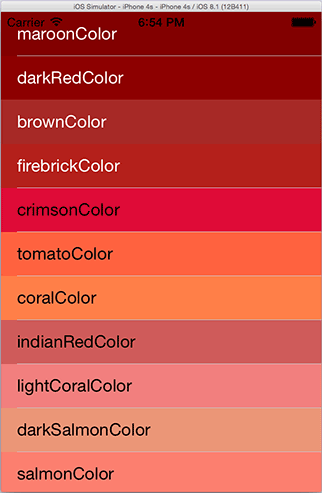

# UIColor+ExtrasDemo

> `UIColor+Extras` extends the existing UIColor class by providing 142 extra named colors. As such it does not require you to make any changes to your existing code beyond placing the folder `UIColor+Extras` in your project. It is packaged with a minimalistic `UIColor+ExtrasDemo` which allows you to scroll through all the available colors presented as colored horizontal strips overlayer with their color name.



## Requirements

`UIColor+Extras` uses ARC and requires iOS 6.0+.


## Installation

### Manual

Copy the folder `UIColor+Extras` to your project.

## Usage

Example, how to use one of the extra colors by setting the backGround color of a UILabel:

``` objc
UILabel *myLabel = [UILabel new];
myLabel.backgroundColor = [UIColor mediumTurquoiseColor];
```

## License

    The MIT License (MIT)

    Copyright (c) 2014 Steve Greenwood

    Permission is hereby granted, free of charge, to any person obtaining a copy
    of this software and associated documentation files (the "Software"), to deal
    in the Software without restriction, including without limitation the rights
    to use, copy, modify, merge, publish, distribute, sublicense, and/or sell
    copies of the Software, and to permit persons to whom the Software is
    furnished to do so, subject to the following conditions:

    The above copyright notice and this permission notice shall be included in
    all copies or substantial portions of the Software.

    THE SOFTWARE IS PROVIDED "AS IS", WITHOUT WARRANTY OF ANY KIND, EXPRESS OR
    IMPLIED, INCLUDING BUT NOT LIMITED TO THE WARRANTIES OF MERCHANTABILITY,
    FITNESS FOR A PARTICULAR PURPOSE AND NONINFRINGEMENT. IN NO EVENT SHALL THE
    AUTHORS OR COPYRIGHT HOLDERS BE LIABLE FOR ANY CLAIM, DAMAGES OR OTHER
    LIABILITY, WHETHER IN AN ACTION OF CONTRACT, TORT OR OTHERWISE, ARISING FROM,
    OUT OF OR IN CONNECTION WITH THE SOFTWARE OR THE USE OR OTHER DEALINGS IN
    THE SOFTWARE.


